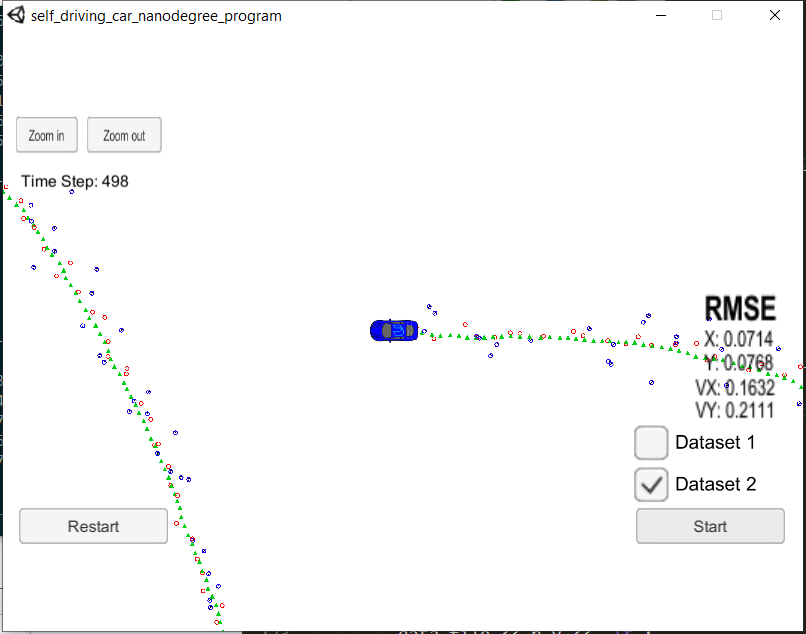
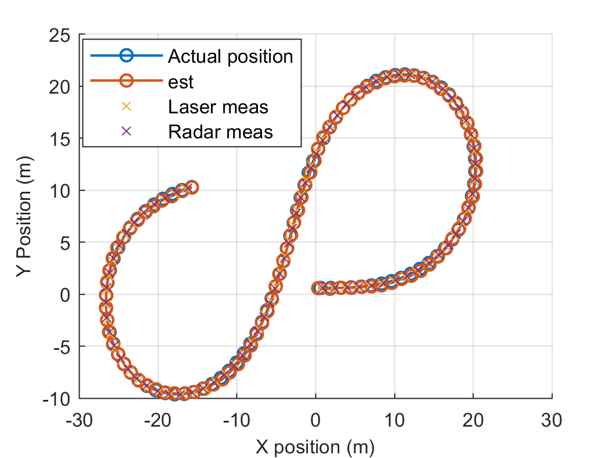
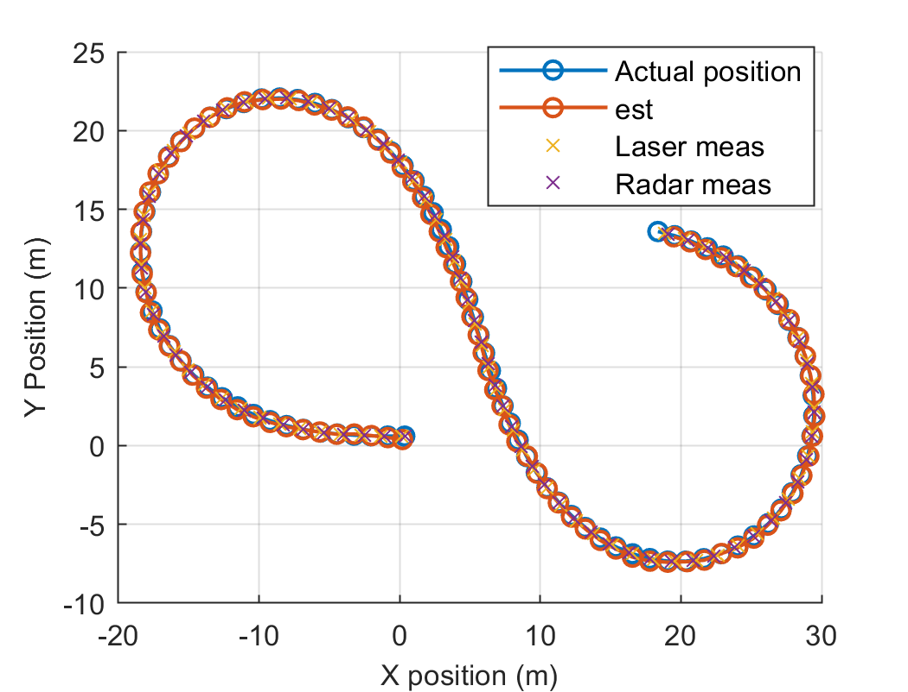
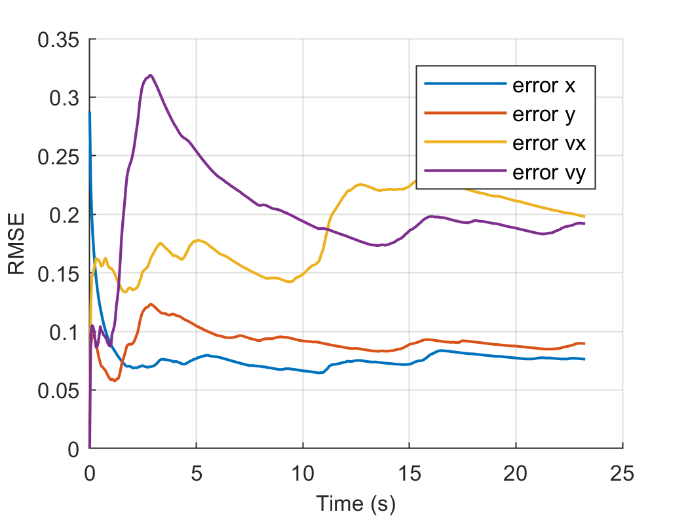
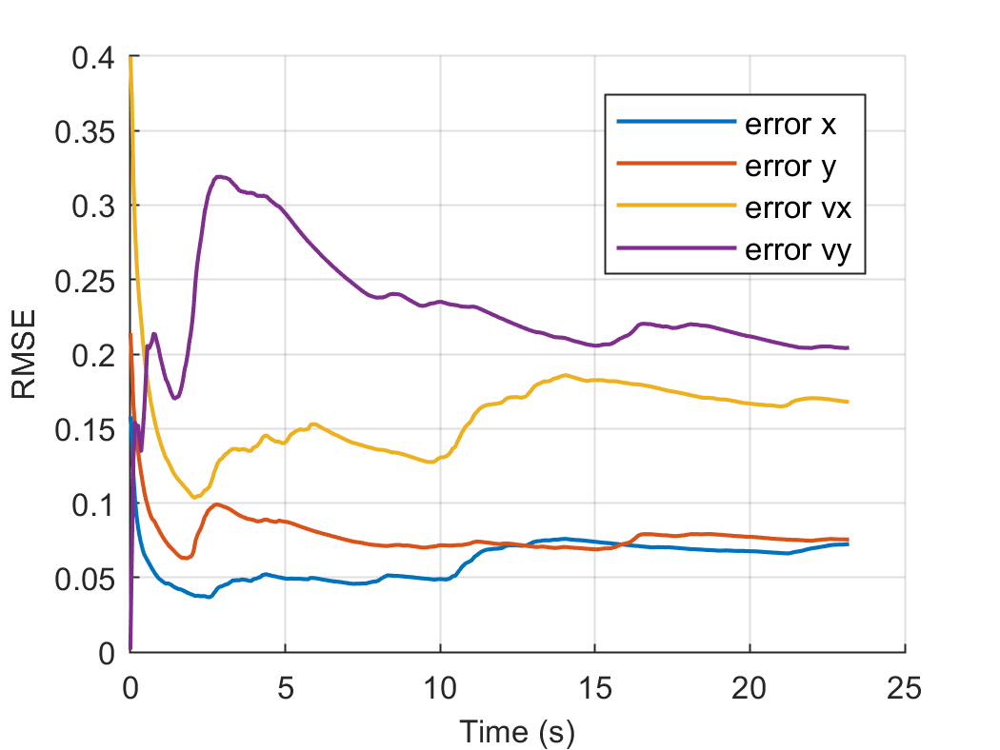
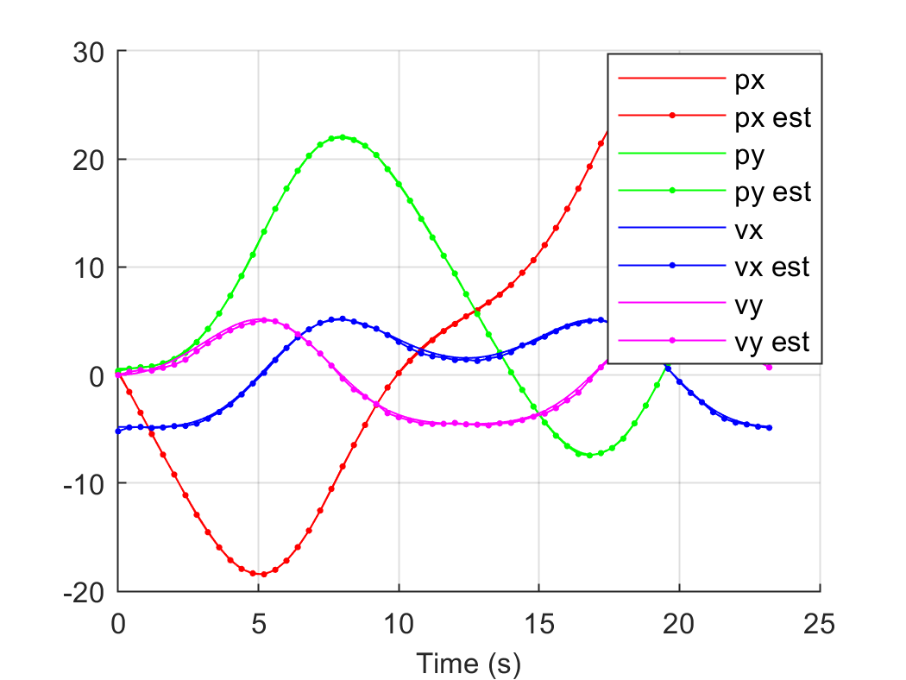
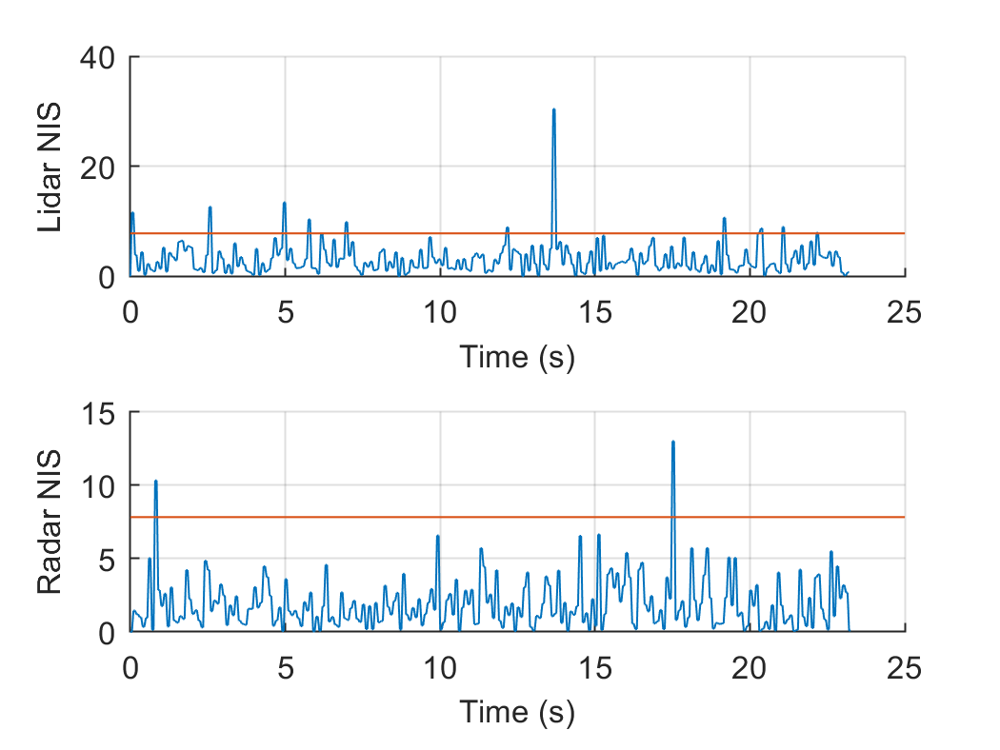
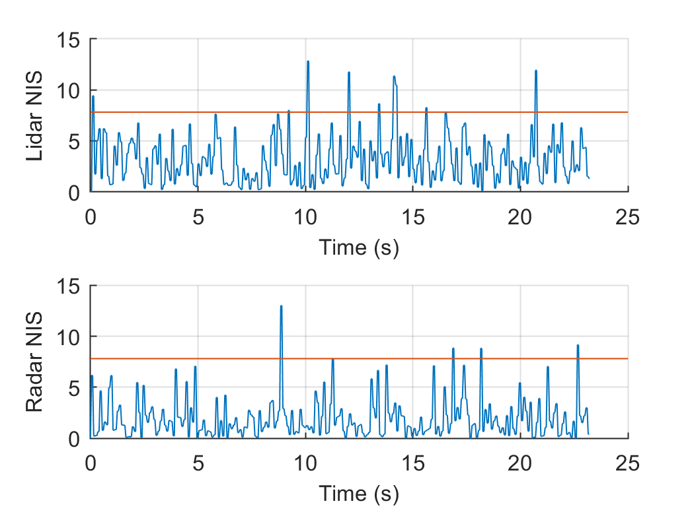

# Unscented Kalman Filter
Self-Driving Car Engineer Nanodegree Program

### Results
In this project, I utilized an Unscented Kalman Filter to estimate the state of a moving object of interest with noisy lidar and radar measurements. 
The RMSE of UKF and EKF on  the test datasets are shown in the following tables. It can be seen that the UKF with lidar and radar data has better performance than other methods.

|  RMSE of Dataset 1|   px  |   py  |   vx  |   vy  |
| ---- | ----- | ----- | ----- | ----- |
| UKF  | 0.075 | 0.088 | 0.192 | 0.199 |
| UKF radar only | 0.180 | 0.188 | 0.266 | 0.329 |
| UKF lidar only  | 0.112 | 0.106 | 0.260 | 0.244 |
| EKF  | 0.097 | 0.085 | 0.451 | 0.440 |

|  RMSE of Dataset 2 |   px  |   py  |   vx  |   vy  |
| ---- | ----- | ----- | ----- | ----- |
| UKF  | 0.071 | 0.077 | 0.163 | 0.211 |
| EKF  | 0.073 | 0.096 | 0.422 | 0.493 |

|       Dataset1        |       Dataset2        |
| :-------------------: | :-------------------: |
|  |  |
|  |  |
|  |  |
|  |  |
|  |  |

(Note: The initialization of x for these two dataset2 are different, they are +-5.2, respectively.)

This project Simulator can be downloaded [here](https://github.com/udacity/self-driving-car-sim/releases)

### Build steps

This repository includes two files that can be used to set up and intall [uWebSocketIO](https://github.com/uWebSockets/uWebSockets) for either Linux or Mac systems. For windows you can use either Docker, VMware, or even [Windows 10 Bash on Ubuntu](https://www.howtogeek.com/249966/how-to-install-and-use-the-linux-bash-shell-on-windows-10/) to install uWebSocketIO. 

1. mkdir build
2. cd build
3. cmake ..
4. make
5. ./UnscentedKF

### Instructions

Here is the main protcol that main.cpp uses for uWebSocketIO in communicating with the simulator.

INPUT: values provided by the simulator to the c++ program

["sensor_measurement"] => the measurment that the simulator observed (either lidar or radar)

OUTPUT: values provided by the c++ program to the simulator

["estimate_x"] <= kalman filter estimated position x

["estimate_y"] <= kalman filter estimated position y

["rmse_x"]

["rmse_y"]

["rmse_vx"]

["rmse_vy"]

---

### Dependencies
* cmake >= 3.5
  * All OSes: [click here for installation instructions](https://cmake.org/install/)
* make >= 4.1 (Linux, Mac), 3.81 (Windows)
  * Linux: make is installed by default on most Linux distros
  * Mac: [install Xcode command line tools to get make](https://developer.apple.com/xcode/features/)
  * Windows: [Click here for installation instructions](http://gnuwin32.sourceforge.net/packages/make.htm)
* gcc/g++ >= 5.4
  * Linux: gcc / g++ is installed by default on most Linux distros
  * Mac: same deal as make - [install Xcode command line tools](https://developer.apple.com/xcode/features/)
  * Windows: recommend using [MinGW](http://www.mingw.org/)

## Basic Build Instructions

1. Clone this repo.
2. Make a build directory: `mkdir build && cd build`
3. Compile: `cmake .. && make`
4. Run it: `./UnscentedKF` Previous versions use i/o from text files.  The current state uses i/o
from the simulator.
